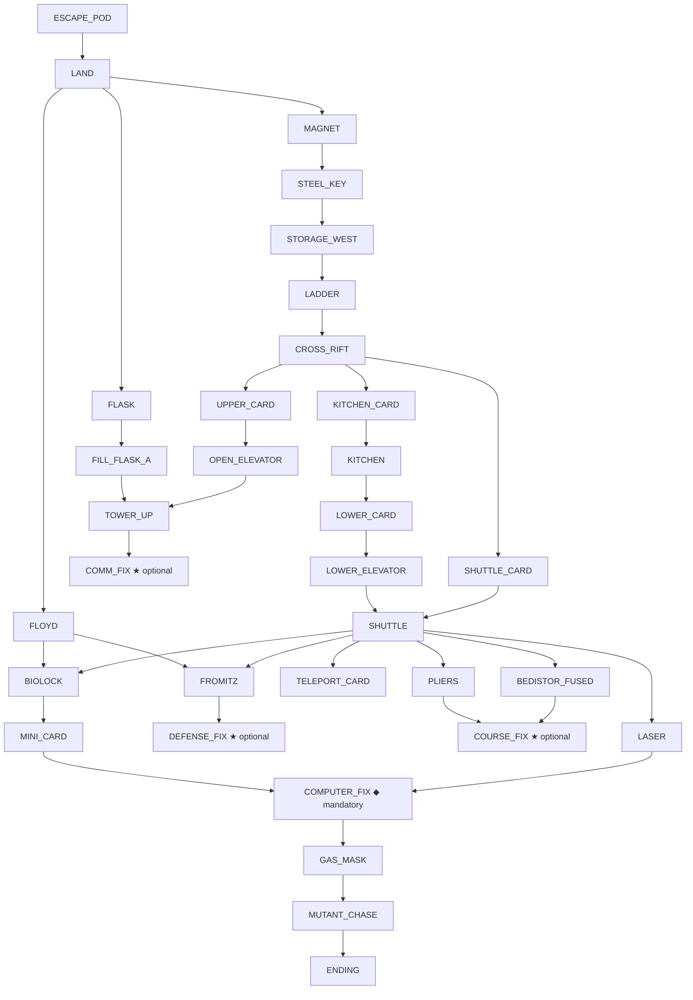

# Planetfall Puzzle DAG (provisional)

Derived from `Planetfall.Tests/Walkthrough/WalkthroughTestOne.cs` (the full 80-point path),
cross-checked against `WalkthroughDontFixAnything.cs` (minimal path), `WalkthroughBioLock.cs`,
`WalkthroughMutantChase.cs`, and the endings logic documented in `Planetfall/PlanetfallContext.cs`.

> ⚠️ **Edges are PROVISIONAL.** Walkthrough *order* is not the same as *dependency*. An edge here
> means "I believe A must happen before B is possible." Each needs confirmation against the ZIL
> (`planetfall-source/`) — true prereq vs incidental ordering. Items flagged **[verify]** are the
> least certain.

## Puzzle nodes

IDs are stable handles for the eval fixtures and retrieval keys. "Score" = the milestone score
checkpoint asserted in the walkthrough at/after that node.

| ID | Puzzle / required action | Location | Score | Notes |
|----|--------------------------|----------|-------|-------|
| `ESCAPE_POD` | Survive the explosion: `port` → `sit` → ride down | Deck Nine → Escape Pod | 3 | Time-gated opening |
| `LAND` | `take kit`, `open door`, exit the pod | Escape Pod | 6 | Underwater → Crag |
| `MAGNET` | `take magnet` | Tool Room | — | Tool for `STEEL_KEY` |
| `FLOYD` | `activate floyd`, wait for him to wake | Robot Shop | 8 | Companion; required later (`MINI_CARD`) |
| `STEEL_KEY` | `put magnet on crevice` → steel key | Admin Corridor South | — | Needs `MAGNET` |
| `STORAGE_WEST` | `unlock padlock with key`, open door | Mess Corridor | 12 | Needs `STEEL_KEY`; yields the ladder |
| `LADDER` | `take ladder` | Storage West | — | Needs `STORAGE_WEST` |
| `CROSS_RIFT` | `extend ladder`, `place ladder across rift`, cross | Admin (South→North) | 16 | Needs `LADDER` |
| `UPPER_CARD` | `open desk`, `take upper card` | Small Office | 17 | Across rift |
| `KITCHEN_CARD` | `take kitchen card` | Small Office | 18 | Across rift |
| `SHUTTLE_CARD` | `open desk`, `take shuttle card` | Large Office | 19 | Across rift; for `SHUTTLE` |
| `KITCHEN` | `slide kitchen card through slot`, enter | Mess Hall → Kitchen | 23 | Needs `KITCHEN_CARD` |
| `LOWER_CARD` | `take lower card` | Kitchen | 24 | Needs `KITCHEN`; for `LOWER_ELEVATOR` |
| `FLASK` | `take flask` | Tool Room | — | Reusable container |
| `FILL_FLASK_A` | `put flask under spout`, `press black button` → milky white | Machine Shop | — | Needs `FLASK` |
| `OPEN_ELEVATOR` | `press blue button`, `press red button`, wait | Elevator Lobby | — | Unlocks upper elevator |
| `TOWER_UP` | `slide upper card`, `press up`, wait | Upper Elevator → Tower Core | 28 | Needs `UPPER_CARD` + `OPEN_ELEVATOR` |
| **`COMM_FIX`** ★ | Tower fluid puzzle: pour fluid into hole (black→gray light), refill (`FILL_FLASK_B`), pour again → "message is now being sent" | Tower Core (NE) | 34 | **Optional system.** Needs `TOWER_UP` + flask fills. **[verify]** mapping to COMM-FIXED |
| `LOWER_ELEVATOR` | `slide lower card`, descend → Kalamontee Platform | Lower Elevator | 38 | Needs `LOWER_CARD` |
| `SHUTTLE` | Alfie: `slide shuttle card`, `push`/`pull lever`, ride to Lawanda | Control → Lawanda | 42 | Needs `SHUTTLE_CARD`; gates the entire Lawanda half |
| `FROMITZ` | `floyd, take board` (shiny fromitz board) | Repair Room | — | Needs `FLOYD`; for `DEFENSE_FIX` |
| **`DEFENSE_FIX`** ★ | `open panel`, `take second` (fried), `put shiny in panel` | Planetary Defense | 48 | **Optional system.** Needs `FROMITZ` → DEFENSE-FIXED |
| `BEDISTOR_FUSED` | `open cube`; bedistor is fused | Course Control | — | Reveals the course-control puzzle |
| `TELEPORT_CARD` | `open pocket` → teleportation access card | Lab Storage | — | Enables teleport booth shortcuts |
| `PLIERS` | `take pliers` | Tool Room | — | For `COURSE_FIX` |
| **`COURSE_FIX`** ★ | `take fused with pliers`, `put good bedistor in cube` | Course Control | 54 | **Optional system.** Needs `BEDISTOR_FUSED` + `PLIERS` + a good bedistor → COURSE-CONTROL-FIXED |
| `LASER` | `take laser`, `remove`/replace battery | Tool Room / Lab Storage | — | Needs fresh battery (Lab Storage) |
| `BIOLOCK` | Floyd sacrifice: `open door`/`close door` sequence → Floyd retrieves the miniaturization card and dies | Bio Lock | 56 | Needs `FLOYD` present; **Floyd dies here (required)** |
| `MINI_CARD` | `take miniaturization card` | Bio Lock East | 57 | Needs `BIOLOCK` |
| **`COMPUTER_FIX`** ◆ | Miniaturize (`slide mini card`, `type 384`), `shoot speck with laser` ×2, exit to Auxiliary Booth | Miniaturization Booth → Microbe strip | 63→75 | **MANDATORY.** Needs `MINI_CARD` + charged `LASER`. Fixes the computer / cures The Disease |
| `GAS_MASK` | `read memo`, `take mask`, `wear gas mask`, `press red button`, open door | Lab Office | — | Needs `COMPUTER_FIX` (auxiliary booth exit) |
| `MUTANT_CHASE` | Flee the mutants back to the Cryo-Elevator, `press button` | Lab → Cryo-Elevator | 80 | Needs `GAS_MASK`; time/chase pressure |
| `ENDING` | wait → Veldina wakes; ending varies by which ★ systems are fixed | Cryo-Anteroom | — | Needs `MUTANT_CHASE` (i.e. `COMPUTER_FIX`) |

★ = optional planetary system (Comm / Defense / Course Control). ◆ = mandatory spine.

## Branch structure (the "not a line" part)

The endings table in `PlanetfallContext.cs` confirms: **`COMPUTER_FIX` → `ENDING` is the
mandatory spine**; the three ★ systems are independent, optional, and order-free relative to each
other. `WalkthroughDontFixAnything.cs` proves a valid game completes with **zero** ★ systems
fixed (the "Doomed Planet" ending). So:

- A hint engine must **not** tell a player "go fix the fromitz board" if they've chosen a
  minimal run — it's optional.
- The three ★ nodes have independent prerequisites and can be done in any order, interleaved with
  the spine. A linear model would impose a false order.

## Mermaid

## Score-checkpoint → node map (for coarse localization fallback)

Score is a *coarse* index — useful only as a tiebreaker when item flags are ambiguous. Out of 80:

`3 ESCAPE_POD · 6 LAND · 8 FLOYD · 12 STORAGE_WEST · 16 CROSS_RIFT · 17–19 office cards ·
23–24 KITCHEN/LOWER_CARD · 28 TOWER_UP · 34 COMM_FIX · 38 LOWER_ELEVATOR · 42 SHUTTLE ·
48 DEFENSE_FIX · 54 COURSE_FIX · 56–57 BIOLOCK/MINI_CARD · 61–75 COMPUTER_FIX · 80 MUTANT_CHASE`

## Survival-clock hints (a parallel, non-DAG hint category)

Planetfall is not just a puzzle graph — it runs three **survival clocks** the player must manage,
and players get stuck or die on these as often as on puzzles. Hints must cover them as a
**separate category** that runs *alongside* DAG progression, keyed on the clock state in
`PlanetfallContext` (`Hunger`, `Tired`, `Day`/sickness — see [02](02-state-audit.md)), not on map position.

| Clock | State source | Hint trigger | Hint content |
|---|---|---|---|
| **Hunger / thirst** | `Hunger` enum | Level escalates toward `Dead` | "You're getting hungry/thirsty — find food and water." Then progressively: where to find rations (kitchen, canteen, dispensers), how to use them. |
| **Sleep / fatigue** | `Tired` enum | Level escalates toward forced sleep | "You're getting tired — find somewhere safe to sleep." Then: where the bunks/dorm are, that sleeping in the wrong place is risky. |
| **The Disease** | `Day`, sickness level | Day advances; symptoms worsen | "You're getting sick and time matters — head for the lab and the cure." Ties into the `COMPUTER_FIX` urgency. See soft-lock [#1](03-softlock.md). |

Design notes:
- These are **time/level-triggered**, not "I'm stuck" triggered — the engine can surface them
  proactively (a gentle nudge as a clock crosses a threshold) *and* answer "how do I deal with
  being tired/hungry/sick?" on demand.
- They ladder like puzzle hints: vague warning → where to find the resource → exact action.
- The **invisiclues already cover these** (e.g. eating the stew, the survival kit, sleeping) — so
  they remain the laddering source here too, exactly as for puzzle hints.
- Distinguish *warning* (recoverable: eat/sleep now) from *terminal* (the clock has reached death
  → handled by the death/restart system, not hints). See [03](03-softlock.md) #1 and #6.

## Open questions for edge verification

1. **`COMM_FIX` ↔ COMM-FIXED** — confirm the tower fluid/"message is now being sent" sequence is
   the Communications repair (vs a distress signal that's separate). **[verify]** against ZIL.
2. **`SHUTTLE` as a hard gate** — confirm nothing in the Lawanda half is reachable before the
   shuttle ride (it appears to be a true cut-point).
3. **`FLOYD` → `BIOLOCK`** — confirm Floyd *must* be alive and present to obtain `MINI_CARD`
   (the sacrifice is scripted) — this also drives soft-lock detection (see [03](03-softlock.md)).
4. **Good-bedistor provenance for `COURSE_FIX`** — where does the *good* bedistor come from, and
   can it be destroyed? (teleport-booth station logic.) **[verify]**
5. **`LASER` battery** — confirm the laser needs the *fresh* battery from Lab Storage and the
   original is dead (soft-lock candidate if the fresh one is mishandled).
