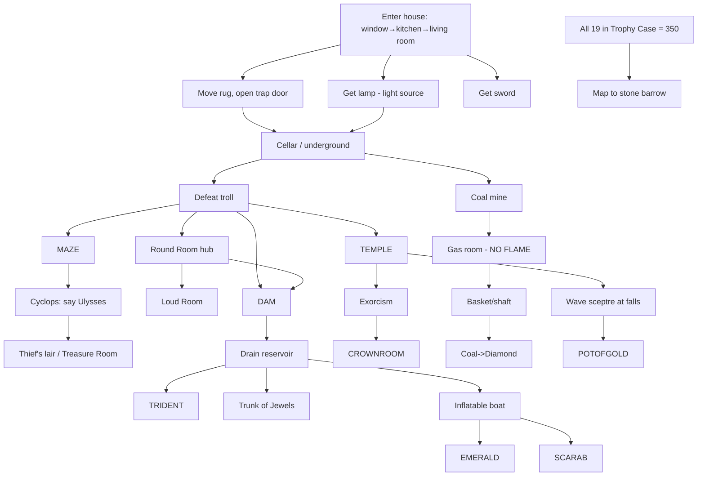

# Zork I Structure & DAG (provisional)

Derived from `ZorkOne.Tests/Walkthrough/WalkthroughTest{One,Two,Three}.cs`, the treasure/scoring
interfaces, and `ZorkIContext`. Read [../00-master-plan.md](../00-master-plan.md) for the shared
architecture — this doc only captures what's **Zork-specific**.

> ⚠️ Edges/regions are PROVISIONAL; verify true dependencies against the ZIL (`zork1/`).

## The fundamental difference from Planetfall

Planetfall is a **guided plot** — a mostly-linear spine with a few optional branches. Zork I is an
**open-ended treasure hunt**: a broad, flat graph of *largely independent* puzzle chains that all
converge on one goal. This changes the hint model:

- **Goal is multi-objective, not a finish line.** Collect **19 treasures** and deposit each in the
  **Trophy Case** (Living Room of the white house). Max **350 points**; `ZorkIContext` sets
  `GameOver` at 350 and then reveals the endgame (map to the stone barrow).
- **Two-stage scoring per treasure** (confirmed in code): `IGivePointsWhenFirstPickedUp` (find it)
  **+** `IGivePointsWhenPlacedInTrophyCase` (deposit it). Localization must track **both** states
  per treasure — "found but not deposited" is a distinct, common state.
- **No single "next step."** At most points many treasures are independently obtainable. The hint
  engine's job is "here are the chains still open to you," not "do step N." This makes the
  **DAG-not-a-line** requirement even more central than in Planetfall.

## The 19 treasures (scoring nodes)

From the `IGivePointsWhenPlacedInTrophyCase` implementers:

`BagOfCoins · Bauble · Canary · Coffin · CrystalSkull · Diamond · Egg · Emerald · JadeFigurine ·
Painting · PlatinumBar · PotOfGold · SapphireBracelet · Scarab · Sceptre · SilverChalice · Torch ·
Trident · TrunkOfJewels` (+ the `TrophyCase` itself is the deposit target).

Each is a **scoring node** with state ∈ `{unfound, held, deposited}`. The `Torch` is special — it's
both a treasure *and* the main deep-mine light source (and a flame — see soft-lock [03](03-softlock.md)).

## Puzzle chains (the "how to get treasure X" subgraphs)

Each chain is largely independent; most hang off a small number of **access gates**. Provisional:

| Chain | Treasure(s) | Key steps / gate |
|---|---|---|
| House entry | (lamp, sword, lunch, garlic — tools, not treasure) | Open window → kitchen → living room → move rug → open trap door |
| Trap door → cellar | gateway to underground | Trap door (may close behind you) |
| Troll | passage gate | Kill the troll to pass (combat) |
| Painting | Painting | Gallery (off cellar) |
| Egg / Canary / Bauble | Egg, Canary, Bauble | Climb tree → egg; **give egg to thief to open** (force-open ruins it — soft-lock [03](03-softlock.md)#1); wind canary in forest → Bauble |
| Thief / Treasure Room | Chalice + recovers stolen treasures | Cyclops (say "Ulysses"/"Odysseus" → flees, opens wall) → thief's lair; defeat thief |
| Maze | Coins, Key, Skeleton/Coffin-adjacent | Navigate the maze (drop-item mapping); skeleton key |
| Dam / Reservoir | Trunk of Jewels, Trident | Open dam (wrench + yellow button at control panel) → drain reservoir |
| Loud Room | Platinum Bar | Echo puzzle (say "echo") |
| Temple / Hades | Coffin, Sceptre, Crystal Skull, Torch | Exorcism: bell + candles + book, in order |
| Rainbow | Pot of Gold | Wave Sceptre at Aragain Falls → solid rainbow |
| Coal mine | Diamond, Jade, Sapphire, Bracelet, Coins | **Gas room (no flame!)**, basket/shaft for torch+screwdriver, coal→diamond machine |
| River / boat | Emerald, Scarab, Buoy | Inflatable boat + pump; **sharp objects puncture it** (soft-lock [03](03-softlock.md)#4) |
| Egyptian / Coffin | Coffin, Sceptre | Inside the coffin is the sceptre |

(Exact treasure-to-chain mapping to be finalized against the walkthroughs/ZIL.)

## Access gates (the real DAG edges)

The chains aren't fully independent — they share a handful of **gates** that everything downstream
depends on. These are the load-bearing edges:

## Localization model (vs Planetfall)

The progress vector is **wider and shallower**: one `{unfound, held, deposited}` state per treasure
plus a boolean per access gate (window open, trap door open, troll dead, cyclops fled, dam drained,
exorcism done, boat inflated, …). "What can I do now?" = open chains whose gates are satisfied.
"What's blocking me?" = the nearest unmet gate on the chain toward a treasure the player seems to be
chasing (inferred from location + recent inputs). Score (of 350) is a coarse tiebreaker, as in
Planetfall.

## Open questions for verification

1. Finalize each treasure → chain mapping and find/deposit point values (ZIL `VALUE`/`TVALUE`).
2. Confirm the access-gate set and which are true cut-points (trap door closing, troll, cyclops, dam).
3. Confirm endgame trigger at exactly 350 and what the barrow map unlocks (`ZorkI.cs`, `ZorkIContext.cs`).
4. Lamp battery / light-source longevity model (drives soft-lock [03](03-softlock.md)#3).
