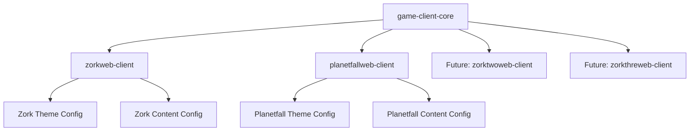

# Web Client Shared Library Refactoring Plan

**Project**: ZorkAI Game Engine
**Date**: 2025-11-24
**Branch**: `claude/shared-webclient-library`
**Status**: Planning Phase

---

## Executive Summary

This document outlines a comprehensive plan to refactor the ZorkWeb.Client and PlanetfallWeb.Client projects by extracting their extensive shared codebase (95%+ duplication) into a reusable core library. This refactoring will:

- **Reduce code duplication by 38%** (~170 files → ~105 files)
- **Improve maintainability** through single-source-of-truth for core functionality
- **Accelerate new game development** by providing a plug-and-play game engine
- **Ensure consistency** across all game implementations
- **Enable rapid feature deployment** across all games simultaneously

### Current State
- Two nearly-identical React/TypeScript web clients
- 95%+ code duplication across projects
- Manual synchronization of bug fixes and features
- Diverging implementations over time

### Target State
- Shared `game-client-core` library containing all common functionality
- Minimal game-specific packages focused on theming and content
- Theme configuration system for visual customization
- Content configuration system for game-specific text/metadata
- Consistent testing and build infrastructure

---

## Table of Contents

1. [Current State Analysis](#current-state-analysis)
2. [Proposed Architecture](#proposed-architecture)
3. [Technical Design](#technical-design)
4. [Implementation Roadmap](#implementation-roadmap)
5. [Migration Strategy](#migration-strategy)
6. [Testing Strategy](#testing-strategy)
7. [Risk Mitigation](#risk-mitigation)
8. [Success Metrics](#success-metrics)

---

## 1. Current State Analysis

### 1.1 Code Duplication Breakdown

#### Completely Identical Files (100% duplication)

**Core Services** (5 files)
- `Server.ts` - API client for game backend communication
- `SessionHandler.ts` - Session state management
- `Mixpanel.ts` - Analytics integration
- `ReleaseNotesServer.ts` - Release notes fetching from GitHub
- `GameContext.tsx` - React context for global game state

**Data Models** (7 files)
- `DialogType.ts` - Modal dialog type enumeration
- `Directions.ts` - Compass direction definitions
- `GameRequest.ts` - API request model
- `GameResponse.ts` - API response model
- `RestoreGameRequest.ts` - Load game request model
- `SavedGame.ts` - Saved game state model
- `SaveGameRequest.ts` - Save game request model

**UI Components** (6 files)
- `CommandsButton.tsx` - Common game commands overlay
- `Compass.tsx` - Directional navigation component
- `GameInput.tsx` - Command input with history
- `Header.tsx` - Top navigation bar
- `InventoryButton.tsx` - Inventory display modal
- `VerbsButton.tsx` - Common verb suggestions

**Menu Components** (2 files)
- `FunctionsMenu.tsx` - Settings and options menu
- `GameMenu.tsx` - Save/load/restart menu

**Modal Components** (6 files)
- `ConfirmationDialog.tsx` - Generic confirmation modal
- `ReleaseNotesModal.tsx` - Display release notes
- `RestartConfirmDialog.tsx` - Restart game confirmation
- `RestoreModal.tsx` - Load saved game modal
- `SaveModal.tsx` - Save game modal
- `VideoModal.tsx` - YouTube video embed modal

**Utilities** (1 file)
- `ClickableText.tsx` - Interactive text component for clickable commands

**Configuration Files** (5 files)
- `jest.config.ts` - Jest testing configuration
- `jest.setup.ts` - Jest environment setup
- `playwright.config.ts` - E2E test configuration
- `postcss.config.js` - PostCSS configuration
- `.eslintrc.cjs` - ESLint code quality rules

**Test Files** (23 files)
- 14 unit test files in `src/__tests__/`
- 9 Playwright E2E test files in `tests/`

**Total Identical Files**: ~55 files (100% duplication)

#### Nearly Identical Files (95-99% similarity)

**Game-Specific with Minimal Differences**:
- `App.tsx` - Different background images, footer presence
- `Game.tsx` - Different color schemes and CSS classes
- `AboutMenu.tsx` - Different external links and menu items
- `WelcomeModal.tsx` - Different game introductions and example commands
- `index.html` - Different titles and metadata
- `config.json` - Different API endpoint URLs

**Total Nearly-Identical Files**: ~6 files

### 1.2 Game-Specific Unique Aspects

#### ZorkWeb.Client Unique Features
1. **Visual Theme**
   - Classic dungeon crawler aesthetic
   - Green text with glow effects
   - Stone/gray color palette (`bg-stone-900`, `border-stone-700`)
   - Simple background pattern image
   - Minimal CSS variables

2. **Content**
   - 1980s fantasy setting (Great Underground Empire)
   - References to Infocom manuals (1982 TRS-80, 1984 versions)
   - Intro video feature
   - Zork-specific walkthrough and map links
   - Credits: Tim Anderson, Marc Blank, Bruce Daniels, Dave Lebling

3. **Assets**
   - `back.png`, `back2.png` - Stone texture patterns
   - Zork-themed favicon and app icons
   - Fonts: Platypi, Roboto Mono, Lato

#### PlanetfallWeb.Client Unique Features
1. **Visual Theme**
   - Sci-fi futuristic aesthetic
   - Warm amber (`#ff9500`) and deep blue (`#0ea5e9`) color scheme
   - Comprehensive CSS variable system (9 custom properties)
   - Advanced animations: `glowPulse`, `slideDown`, `scanline`
   - Nebula background image from S3 with parallax effect
   - Glass morphism effects with backdrop blur
   - Scanline overlay for retro-futuristic CRT effect
   - Footer with GitHub link

2. **Content**
   - 1983 sci-fi setting (crash on planet Resida, Floyd the robot)
   - Planetfall manual, map, walkthrough links
   - No intro video feature
   - Planetfall-specific Wikipedia link
   - Credits: Steve Meretzky

3. **Assets**
   - Nebula background image (remote S3 URL)
   - Planetfall-themed favicon and app icons
   - Fonts: Bebas Neue, Roboto Mono

### 1.3 Dependency Analysis

Both projects share **100% identical dependencies**:

**Core Dependencies**:
- React 18.2.0
- TypeScript 5.2.2
- Vite 5.2.8
- TailwindCSS 3.4.1
- DaisyUI 4.7.3
- Material-UI 5.15.15
- Axios 1.6.8
- React Query 5.29.2
- Mixpanel Browser 2.58.0

**Testing Dependencies**:
- Jest 29.7.0
- Playwright 1.43.1
- Testing Library (React, Jest-DOM, User-Event)

**Only Difference**: Package name (`zorkweb.client` vs `planetfall.client`)

### 1.4 Problems with Current Architecture

1. **Maintenance Burden**: Bug fixes must be manually applied to both codebases
2. **Feature Divergence**: New features risk inconsistent implementation
3. **Testing Overhead**: Identical tests duplicated and must be maintained separately
4. **Onboarding Complexity**: New developers must understand two separate codebases
5. **Scalability Issues**: Adding a third game (e.g., ZorkTwo) would triple the duplication
6. **Code Review Inefficiency**: PRs often require changes in both repos
7. **Build Pipeline Duplication**: CI/CD configurations duplicated

---

## 2. Proposed Architecture

### 2.1 Monorepo Structure

```
ZorkAI/
├── WebClients/                          # New top-level web clients directory
│   ├── packages/
│   │   ├── game-client-core/           # Shared library (NPM package)
│   │   │   ├── src/
│   │   │   │   ├── components/         # Shared UI components
│   │   │   │   ├── menu/               # Shared menu components
│   │   │   │   ├── modal/              # Shared modal components
│   │   │   │   ├── model/              # TypeScript interfaces
│   │   │   │   ├── services/           # API clients, session management
│   │   │   │   ├── context/            # React contexts
│   │   │   │   ├── hooks/              # Custom React hooks
│   │   │   │   ├── utils/              # Utility functions
│   │   │   │   ├── theme/              # Theme system
│   │   │   │   └── __tests__/          # Shared tests
│   │   │   ├── config/
│   │   │   │   ├── jest.config.base.ts
│   │   │   │   ├── playwright.config.base.ts
│   │   │   │   └── tsconfig.base.json
│   │   │   ├── package.json
│   │   │   ├── tsconfig.json
│   │   │   └── README.md
│   │   │
│   │   ├── zorkweb-client/             # Zork-specific implementation
│   │   │   ├── src/
│   │   │   │   ├── config/
│   │   │   │   │   ├── theme.config.ts         # Zork theme
│   │   │   │   │   ├── game.config.ts          # Game metadata
│   │   │   │   │   └── content.config.tsx      # Game-specific content
│   │   │   │   ├── menu/
│   │   │   │   │   └── AboutMenu.tsx           # Zork about menu
│   │   │   │   ├── modal/
│   │   │   │   │   └── WelcomeModal.tsx        # Zork welcome
│   │   │   │   ├── App.tsx                     # Zork app wrapper
│   │   │   │   ├── main.tsx                    # Entry point
│   │   │   │   ├── index.css                   # Zork styles
│   │   │   │   └── assets/                     # Zork images/fonts
│   │   │   ├── public/                         # Zork favicon, manifest
│   │   │   ├── config.json
│   │   │   ├── package.json
│   │   │   ├── vite.config.ts
│   │   │   └── tsconfig.json
│   │   │
│   │   └── planetfallweb-client/       # Planetfall-specific implementation
│   │       ├── src/
│   │       │   ├── config/
│   │       │   │   ├── theme.config.ts         # Planetfall theme
│   │       │   │   ├── game.config.ts          # Game metadata
│   │       │   │   └── content.config.tsx      # Game-specific content
│   │       │   ├── menu/
│   │       │   │   └── AboutMenu.tsx           # Planetfall about menu
│   │       │   ├── modal/
│   │       │   │   └── WelcomeModal.tsx        # Planetfall welcome
│   │       │   ├── App.tsx                     # Planetfall app wrapper
│   │       │   ├── main.tsx                    # Entry point
│   │       │   ├── index.css                   # Planetfall styles
│   │       │   └── assets/                     # Planetfall images/fonts
│   │       ├── public/                         # Planetfall favicon, manifest
│   │       ├── config.json
│   │       ├── package.json
│   │       ├── vite.config.ts
│   │       └── tsconfig.json
│   │
│   ├── package.json                    # Workspace root
│   ├── tsconfig.json                   # Root TypeScript config
│   └── README.md                       # Documentation
│
├── ZorkOne/                            # Existing C# game implementations
├── Planetfall/
└── [other existing directories...]
```

### 2.2 Package Relationships



### 2.3 Dependency Flow

1. **Game-specific clients** depend on `game-client-core`
2. **Core library** has no game-specific dependencies
3. **Theme configurations** inject styling through CSS variables
4. **Content configurations** provide game-specific text and metadata
5. **All shared components** accept theme and content through React context

---

## 3. Technical Design

### 3.1 Theme System Architecture

#### Theme Configuration Interface

```typescript
// game-client-core/src/theme/types.ts

export interface GameTheme {
  // Basic identity
  name: string;
  title: string;

  // Color system
  colors: {
    primary: string;
    secondary: string;
    accent: string;
    background: {
      dark: string;
      medium: string;
      light: string;
    };
    text: {
      primary: string;
      secondary: string;
      muted: string;
    };
    border: string;
    compass: string;
    // ... additional color tokens
  };

  // Typography
  fonts: {
    heading: string;
    body: string;
    mono: string;
    sizes: {
      xs: string;
      sm: string;
      base: string;
      lg: string;
      xl: string;
      '2xl': string;
      '3xl': string;
    };
  };

  // Visual effects
  effects: {
    enableGlow: boolean;
    enableScanlines: boolean;
    enableGlassMorphism: boolean;
    enableAnimations: boolean;
    glowColor?: string;
    glowIntensity?: number;
  };

  // Background configuration
  background: {
    type: 'image' | 'gradient' | 'pattern' | 'solid';
    value: string;
    attachment?: 'fixed' | 'scroll';
    repeat?: 'repeat' | 'no-repeat' | 'repeat-x' | 'repeat-y';
    position?: string;
    size?: string;
    overlay?: {
      enabled: boolean;
      gradient?: string;
      opacity?: number;
    };
  };

  // Layout
  layout: {
    maxWidth: string;
    padding: string;
    borderRadius: string;
    showFooter: boolean;
    footerContent?: React.ReactNode;
  };

  // Component-specific overrides
  components: {
    input: {
      backgroundColor: string;
      borderColor: string;
      textColor: string;
      focusColor: string;
    };
    button: {
      primaryBg: string;
      primaryHoverBg: string;
      secondaryBg: string;
      secondaryHoverBg: string;
    };
    modal: {
      backgroundColor: string;
      overlayColor: string;
      borderColor: string;
    };
    // ... other component overrides
  };
}

export interface GameThemeConfig {
  theme: GameTheme;
  customCSS?: string; // Additional CSS for advanced customization
}
```

#### Theme Provider Implementation

```typescript
// game-client-core/src/theme/ThemeProvider.tsx

import React, { createContext, useContext, useEffect } from 'react';
import { GameTheme, GameThemeConfig } from './types';

interface ThemeContextValue {
  theme: GameTheme;
  applyTheme: () => void;
}

const ThemeContext = createContext<ThemeContextValue | undefined>(undefined);

export const useTheme = () => {
  const context = useContext(ThemeContext);
  if (!context) {
    throw new Error('useTheme must be used within ThemeProvider');
  }
  return context;
};

interface ThemeProviderProps {
  config: GameThemeConfig;
  children: React.ReactNode;
}

export const ThemeProvider: React.FC<ThemeProviderProps> = ({
  config,
  children
}) => {
  const { theme, customCSS } = config;

  const applyTheme = () => {
    const root = document.documentElement;

    // Apply color variables
    root.style.setProperty('--color-primary', theme.colors.primary);
    root.style.setProperty('--color-secondary', theme.colors.secondary);
    root.style.setProperty('--color-accent', theme.colors.accent);
    root.style.setProperty('--color-bg-dark', theme.colors.background.dark);
    root.style.setProperty('--color-bg-medium', theme.colors.background.medium);
    root.style.setProperty('--color-bg-light', theme.colors.background.light);
    root.style.setProperty('--color-text-primary', theme.colors.text.primary);
    root.style.setProperty('--color-text-secondary', theme.colors.text.secondary);
    root.style.setProperty('--color-text-muted', theme.colors.text.muted);
    root.style.setProperty('--color-border', theme.colors.border);
    root.style.setProperty('--color-compass', theme.colors.compass);

    // Apply font variables
    root.style.setProperty('--font-heading', theme.fonts.heading);
    root.style.setProperty('--font-body', theme.fonts.body);
    root.style.setProperty('--font-mono', theme.fonts.mono);

    // Apply effect classes conditionally
    root.classList.toggle('enable-glow', theme.effects.enableGlow);
    root.classList.toggle('enable-scanlines', theme.effects.enableScanlines);
    root.classList.toggle('enable-glass', theme.effects.enableGlassMorphism);
    root.classList.toggle('enable-animations', theme.effects.enableAnimations);

    // Inject custom CSS if provided
    if (customCSS) {
      const styleId = 'game-theme-custom-css';
      let styleElement = document.getElementById(styleId);

      if (!styleElement) {
        styleElement = document.createElement('style');
        styleElement.id = styleId;
        document.head.appendChild(styleElement);
      }

      styleElement.textContent = customCSS;
    }
  };

  useEffect(() => {
    applyTheme();
  }, [theme, customCSS]);

  return (
    <ThemeContext.Provider value={{ theme, applyTheme }}>
      {children}
    </ThemeContext.Provider>
  );
};
```

#### Example Theme Configurations

```typescript
// zorkweb-client/src/config/theme.config.ts

import { GameThemeConfig } from 'game-client-core/theme';

export const zorkTheme: GameThemeConfig = {
  theme: {
    name: 'zork-classic',
    title: 'Zork AI',

    colors: {
      primary: '#84cc16',      // lime-500 - classic Zork green
      secondary: '#78716c',    // stone-500
      accent: '#a3e635',       // lime-400
      background: {
        dark: '#1c1917',       // stone-900
        medium: '#292524',     // stone-800
        light: '#44403c',      // stone-700
      },
      text: {
        primary: '#fafaf9',    // stone-50
        secondary: '#e7e5e4',  // stone-200
        muted: '#a8a29e',      // stone-400
      },
      border: 'rgba(68, 64, 60, 0.5)',  // stone-700/50
      compass: '#84cc16',
    },

    fonts: {
      heading: 'Platypi, serif',
      body: 'Lato, sans-serif',
      mono: 'Roboto Mono, monospace',
      sizes: {
        xs: '0.75rem',
        sm: '0.875rem',
        base: '1rem',
        lg: '1.125rem',
        xl: '1.25rem',
        '2xl': '1.5rem',
        '3xl': '1.875rem',
      },
    },

    effects: {
      enableGlow: true,
      enableScanlines: false,
      enableGlassMorphism: false,
      enableAnimations: true,
      glowColor: '#84cc16',
      glowIntensity: 8,
    },

    background: {
      type: 'pattern',
      value: '/assets/back2.png',
      repeat: 'repeat',
      attachment: 'scroll',
    },

    layout: {
      maxWidth: '100vw',
      padding: '1rem',
      borderRadius: '0.5rem',
      showFooter: false,
    },

    components: {
      input: {
        backgroundColor: 'rgba(28, 25, 23, 0.9)',
        borderColor: 'rgba(68, 64, 60, 0.5)',
        textColor: '#fafaf9',
        focusColor: '#84cc16',
      },
      button: {
        primaryBg: '#84cc16',
        primaryHoverBg: '#a3e635',
        secondaryBg: '#292524',
        secondaryHoverBg: '#44403c',
      },
      modal: {
        backgroundColor: 'rgba(28, 25, 23, 0.95)',
        overlayColor: 'rgba(0, 0, 0, 0.75)',
        borderColor: 'rgba(68, 64, 60, 0.5)',
      },
    },
  },

  customCSS: `
    /* Zork-specific custom styles */
    .game-text {
      text-shadow: 0 0 8px var(--color-primary);
    }

    .enable-glow .glow-effect {
      box-shadow: 0 0 10px var(--color-primary),
                  0 0 20px var(--color-primary);
    }
  `,
};
```

```typescript
// planetfallweb-client/src/config/theme.config.ts

import { GameThemeConfig } from 'game-client-core/theme';

export const planetfallTheme: GameThemeConfig = {
  theme: {
    name: 'planetfall-scifi',
    title: 'Planetfall AI',

    colors: {
      primary: '#ff9500',      // Warm amber
      secondary: '#0ea5e9',    // Deep blue (sky-500)
      accent: '#fbbf24',       // Gold (amber-400)
      background: {
        dark: '#0a1929',
        medium: '#1e293b',     // slate-800
        light: '#334155',      // slate-700
      },
      text: {
        primary: '#f8fafc',    // slate-50
        secondary: '#e2e8f0',  // slate-200
        muted: '#94a3b8',      // slate-400
      },
      border: 'rgba(51, 65, 85, 0.6)',
      compass: '#0095ff',
    },

    fonts: {
      heading: 'Bebas Neue, sans-serif',
      body: 'Roboto, sans-serif',
      mono: 'Roboto Mono, monospace',
      sizes: {
        xs: '0.75rem',
        sm: '0.875rem',
        base: '1rem',
        lg: '1.125rem',
        xl: '1.25rem',
        '2xl': '1.5rem',
        '3xl': '1.875rem',
      },
    },

    effects: {
      enableGlow: true,
      enableScanlines: true,
      enableGlassMorphism: true,
      enableAnimations: true,
      glowColor: '#ff9500',
      glowIntensity: 12,
    },

    background: {
      type: 'image',
      value: 'https://zork-game-saves.s3.us-west-2.amazonaws.com/nebula.webp',
      attachment: 'fixed',
      size: 'cover',
      position: 'center',
      overlay: {
        enabled: true,
        gradient: 'linear-gradient(to bottom, rgba(10, 25, 41, 0.7), rgba(10, 25, 41, 0.9))',
        opacity: 0.8,
      },
    },

    layout: {
      maxWidth: '100vw',
      padding: '1rem',
      borderRadius: '0.75rem',
      showFooter: true,
      footerContent: (
        <div className="text-center text-sm py-4">
          <a
            href="https://github.com/arsindelve"
            target="_blank"
            rel="noopener noreferrer"
            className="text-[var(--color-primary)] hover:text-[var(--color-accent)]"
          >
            GitHub
          </a>
        </div>
      ),
    },

    components: {
      input: {
        backgroundColor: 'rgba(10, 25, 41, 0.9)',
        borderColor: 'color-mix(in srgb, var(--color-primary) 30%, transparent)',
        textColor: '#f8fafc',
        focusColor: '#ff9500',
      },
      button: {
        primaryBg: '#ff9500',
        primaryHoverBg: '#fbbf24',
        secondaryBg: '#1e293b',
        secondaryHoverBg: '#334155',
      },
      modal: {
        backgroundColor: 'rgba(10, 25, 41, 0.95)',
        overlayColor: 'rgba(0, 0, 0, 0.85)',
        borderColor: 'color-mix(in srgb, var(--color-primary) 30%, transparent)',
      },
    },
  },

  customCSS: `
    /* Planetfall sci-fi effects */
    @keyframes glowPulse {
      0%, 100% { box-shadow: 0 0 10px var(--color-primary); }
      50% { box-shadow: 0 0 20px var(--color-primary), 0 0 30px var(--color-accent); }
    }

    @keyframes scanline {
      0% { transform: translateY(-100%); }
      100% { transform: translateY(100vh); }
    }

    .enable-animations .pulse-glow {
      animation: glowPulse 2s ease-in-out infinite;
    }

    .enable-scanlines::before {
      content: '';
      position: fixed;
      top: 0;
      left: 0;
      width: 100%;
      height: 2px;
      background: linear-gradient(
        to bottom,
        transparent,
        rgba(255, 149, 0, 0.3),
        transparent
      );
      animation: scanline 8s linear infinite;
      pointer-events: none;
      z-index: 9999;
    }

    .enable-glass {
      backdrop-filter: blur(10px);
      background: rgba(10, 25, 41, 0.7) !important;
    }

    .neon-border {
      border: 2px solid;
      border-image: linear-gradient(
        135deg,
        var(--color-primary),
        var(--color-secondary),
        var(--color-accent)
      ) 1;
      box-shadow:
        0 0 10px color-mix(in srgb, var(--color-primary) 50%, transparent),
        inset 0 0 10px color-mix(in srgb, var(--color-primary) 20%, transparent);
    }
  `,
};
```

### 3.2 Content Configuration System

```typescript
// game-client-core/src/content/types.ts

export interface GameMetadata {
  name: string;
  fullTitle: string;
  subtitle?: string;
  year: string;
  version: string;
  creators: string[];
  publisher: string;
  description: string;
  genre: string[];
}

export interface WelcomeContent {
  title: string;
  paragraphs: string[];
  exampleCommands: Array<{
    command: string;
    description: string;
  }>;
  showVideoButton: boolean;
  videoId?: string;
  additionalButtons?: Array<{
    label: string;
    onClick: () => void;
  }>;
}

export interface MenuItem {
  label: string;
  href: string;
  external: boolean;
  icon?: React.ReactNode;
}

export interface AboutContent {
  title: string;
  description: string;
  sections: Array<{
    title: string;
    items: MenuItem[];
  }>;
}

export interface GameContentConfig {
  metadata: GameMetadata;
  welcome: WelcomeContent;
  about: AboutContent;
  assets: {
    favicon: string;
    logo?: string;
    backgroundImage?: string;
    screenshots?: string[];
  };
  api: {
    baseUrl: string;
    endpoints: {
      game: string;
      save: string;
      restore: string;
      session: string;
    };
  };
  analytics?: {
    mixpanelToken: string;
    enableTracking: boolean;
  };
}
```

```typescript
// zorkweb-client/src/config/content.config.tsx

import { GameContentConfig } from 'game-client-core/content';

export const zorkContent: GameContentConfig = {
  metadata: {
    name: 'Zork I',
    fullTitle: 'Zork I: The Great Underground Empire',
    year: '1980',
    version: '0.2.12',
    creators: [
      'Tim Anderson',
      'Marc Blank',
      'Bruce Daniels',
      'Dave Lebling'
    ],
    publisher: 'Infocom',
    description: 'A classic text adventure game set in the Great Underground Empire. Explore, solve puzzles, and hunt for treasure in this iconic interactive fiction.',
    genre: ['Interactive Fiction', 'Adventure', 'Puzzle'],
  },

  welcome: {
    title: 'Welcome to Zork AI - A Modern Reimagining of the 1980s Classic!',
    paragraphs: [
      'You are about to experience Zork I: The Great Underground Empire, one of the most influential text adventure games ever created. In this game, you will explore an ancient underground realm, solve intricate puzzles, and seek out precious treasures.',
      'This modern version enhances the classic Zork experience with AI-powered natural language understanding, allowing you to interact with the game world in more intuitive and flexible ways.',
    ],
    exampleCommands: [
      { command: 'open mailbox', description: 'Interact with objects' },
      { command: 'go south', description: 'Navigate the world' },
      { command: 'take all', description: 'Manage inventory' },
      { command: 'examine lamp', description: 'Investigate your surroundings' },
      { command: 'tell me about the empire', description: 'Ask questions (AI-powered)' },
    ],
    showVideoButton: true,
    videoId: 'VIDEO_ID_HERE',
  },

  about: {
    title: 'About Zork I',
    description: 'Zork I: The Great Underground Empire is a text adventure game originally developed by MIT students and published by Infocom in 1980.',
    sections: [
      {
        title: 'Resources',
        items: [
          {
            label: 'What is this game?',
            href: '#',
            external: false,
          },
          {
            label: '1984 Infocom Manual',
            href: 'https://archive.org/details/Zork_I_The_Great_Underground_Empire_1984_Infocom',
            external: true,
          },
          {
            label: '1982 TRS-80 Manual',
            href: 'https://archive.org/details/Zork_I_The_Great_Underground_Empire_1982_Infocom_TRS-80',
            external: true,
          },
          {
            label: 'Zork Map',
            href: 'https://www.thezorklibrary.com/maps/zork1.html',
            external: true,
          },
          {
            label: 'Zork Walkthrough',
            href: 'https://www.walkthroughking.com/text/zork1.aspx',
            external: true,
          },
          {
            label: 'Play Original Zork One Online',
            href: 'https://playclassic.games/games/adventure-dos-games-online/play-zork-great-underground-empire-online/',
            external: true,
          },
          {
            label: 'Wikipedia: Zork',
            href: 'https://en.wikipedia.org/wiki/Zork',
            external: true,
          },
        ],
      },
    ],
  },

  assets: {
    favicon: '/favicon.ico',
    logo: '/Zork.webp',
    backgroundImage: '/back2.png',
  },

  api: {
    baseUrl: process.env.VITE_API_BASE_URL || 'http://localhost:5000',
    endpoints: {
      game: '/ZorkOne',
      save: '/ZorkOne/saveGame',
      restore: '/ZorkOne/restoreGame',
      session: '/ZorkOne/session',
    },
  },

  analytics: {
    mixpanelToken: process.env.VITE_MIXPANEL_TOKEN || '',
    enableTracking: true,
  },
};
```

### 3.3 Core Library Component Updates

All shared components will be updated to consume theme and content from context:

```typescript
// game-client-core/src/components/Header.tsx

import React from 'react';
import { useTheme } from '../theme/ThemeProvider';
import { useGameContent } from '../content/ContentProvider';

export const Header: React.FC = () => {
  const { theme } = useTheme();
  const { metadata } = useGameContent();

  return (
    <header
      className="sticky top-0 z-50 px-4 py-3"
      style={{
        backgroundColor: `color-mix(in srgb, ${theme.colors.background.dark} 95%, transparent)`,
        borderBottom: `1px solid ${theme.colors.border}`,
        backdropFilter: theme.effects.enableGlassMorphism ? 'blur(10px)' : 'none',
      }}
    >
      <div className="flex items-center justify-between">
        <h1
          className="text-2xl font-bold"
          style={{
            color: theme.colors.primary,
            fontFamily: theme.fonts.heading,
            textShadow: theme.effects.enableGlow
              ? `0 0 10px ${theme.effects.glowColor}`
              : 'none',
          }}
        >
          {metadata.fullTitle}
        </h1>

        <div className="flex items-center gap-4">
          {/* Menu buttons */}
        </div>
      </div>
    </header>
  );
};
```

### 3.4 Game-Specific Component Overrides

Game-specific components (AboutMenu, WelcomeModal) become thin wrappers around content:

```typescript
// zorkweb-client/src/menu/AboutMenu.tsx

import React from 'react';
import { AboutMenuCore } from 'game-client-core/menu';
import { zorkContent } from '../config/content.config';

export const AboutMenu: React.FC = () => {
  return <AboutMenuCore content={zorkContent.about} />;
};
```

```typescript
// game-client-core/src/menu/AboutMenuCore.tsx

import React from 'react';
import { AboutContent } from '../content/types';
import { useTheme } from '../theme/ThemeProvider';

interface AboutMenuCoreProps {
  content: AboutContent;
}

export const AboutMenuCore: React.FC<AboutMenuCoreProps> = ({ content }) => {
  const { theme } = useTheme();

  return (
    <div className="menu-container">
      <h2>{content.title}</h2>
      <p>{content.description}</p>

      {content.sections.map((section, idx) => (
        <div key={idx}>
          <h3>{section.title}</h3>
          <ul>
            {section.items.map((item, itemIdx) => (
              <li key={itemIdx}>
                <a
                  href={item.href}
                  target={item.external ? '_blank' : '_self'}
                  rel={item.external ? 'noopener noreferrer' : undefined}
                  style={{ color: theme.colors.primary }}
                >
                  {item.label}
                </a>
              </li>
            ))}
          </ul>
        </div>
      ))}
    </div>
  );
};
```

---

## 4. Implementation Roadmap

### Phase 1: Foundation Setup (Week 1)

**Objectives**:
- Create monorepo structure
- Set up build infrastructure
- Establish testing framework

**Tasks**:
1. Create `WebClients/` directory structure
2. Initialize `game-client-core` package
   - Set up TypeScript configuration
   - Configure build pipeline (Vite/Rollup)
   - Set up package.json with proper exports
3. Configure workspace (npm workspaces or pnpm workspace)
4. Set up shared testing infrastructure
   - Base Jest configuration
   - Base Playwright configuration
   - Shared test utilities
5. Configure CI/CD for monorepo
   - Build all packages
   - Run all tests
   - Parallel builds where possible

**Deliverables**:
- ✅ Monorepo structure created
- ✅ Build pipeline functional
- ✅ CI/CD configured and passing
- ✅ Documentation for new structure

**Success Criteria**:
- All packages build successfully
- Tests can run in isolation and together
- CI/CD pipeline green

---

### Phase 2: Theme System Implementation (Week 2)

**Objectives**:
- Design and implement theme abstraction
- Create Zork and Planetfall theme configurations
- Validate theme switching works correctly

**Tasks**:
1. Implement theme type definitions (`theme/types.ts`)
2. Create ThemeProvider component
3. Implement CSS variable injection system
4. Create Zork theme configuration
5. Create Planetfall theme configuration
6. Test theme switching between configs
7. Document theme system usage

**Deliverables**:
- ✅ Theme system fully functional
- ✅ Both game themes configured
- ✅ Theme documentation complete
- ✅ Example theme added for future games

**Success Criteria**:
- Themes apply correctly on load
- CSS variables update properly
- Visual parity with original designs
- Performance impact < 50ms on theme switch

---

### Phase 3: Content Configuration System (Week 2-3)

**Objectives**:
- Design content configuration interface
- Extract game-specific content to config files
- Implement ContentProvider

**Tasks**:
1. Define content type definitions (`content/types.ts`)
2. Create ContentProvider component
3. Extract Zork content to configuration
4. Extract Planetfall content to configuration
5. Update core components to use content from context
6. Test content switching
7. Document content system

**Deliverables**:
- ✅ Content system fully functional
- ✅ Both games configured with content
- ✅ Content documentation complete
- ✅ Content migration guide for new games

**Success Criteria**:
- Content loads correctly for each game
- No hardcoded game-specific text in core
- Easy to add new games
- Type-safe content access

---

### Phase 4: Core Library Extraction (Week 3-4)

**Objectives**:
- Move all shared code to `game-client-core`
- Maintain 100% functionality
- Preserve all tests

**Tasks**:

**Sprint 4.1: Services & Models**
1. Move all model files to `game-client-core/src/model/`
2. Move Server.ts, SessionHandler.ts
3. Move Mixpanel.ts, ReleaseNotesServer.ts
4. Move GameContext.tsx
5. Update imports in core library
6. Run tests to verify functionality

**Sprint 4.2: Components**
1. Move all 6 UI components to `game-client-core/src/components/`
2. Update components to use ThemeProvider
3. Update components to use ContentProvider where needed
4. Verify component styling with both themes
5. Run visual regression tests

**Sprint 4.3: Menus & Modals**
1. Move FunctionsMenu, GameMenu to `game-client-core/src/menu/`
2. Move all modal components except AboutMenu, WelcomeModal
3. Create AboutMenuCore and WelcomeModalCore templates
4. Update modals to use theme/content
5. Test all modals with both games

**Sprint 4.4: Utilities & Helpers**
1. Move ClickableText.tsx
2. Extract any shared utility functions
3. Move shared test utilities
4. Create testing helpers for themes/content

**Deliverables**:
- ✅ All shared code in `game-client-core`
- ✅ Zero duplication between game packages
- ✅ All tests passing
- ✅ Build size optimized

**Success Criteria**:
- 100% test pass rate maintained
- No functionality regressions
- Build times acceptable (< 30s for core lib)
- Bundle size not increased significantly

---

### Phase 5: Game Package Refactoring (Week 4-5)

**Objectives**:
- Slim down game-specific packages
- Wire up theme and content configurations
- Remove all duplicated code

**Tasks**:

**Sprint 5.1: ZorkWeb Refactoring**
1. Create `zorkweb-client` package structure
2. Implement theme.config.ts
3. Implement content.config.ts
4. Implement game-specific AboutMenu
5. Implement game-specific WelcomeModal
6. Update App.tsx to use core library + configs
7. Update main.tsx entry point
8. Move game-specific styles to index.css
9. Update all imports to use `game-client-core`
10. Run full test suite
11. Visual QA against original

**Sprint 5.2: PlanetfallWeb Refactoring**
1. Create `planetfallweb-client` package structure
2. Implement theme.config.ts
3. Implement content.config.ts
4. Implement game-specific AboutMenu
5. Implement game-specific WelcomeModal
6. Update App.tsx to use core library + configs
7. Update main.tsx entry point
8. Move game-specific styles to index.css
9. Update all imports to use `game-client-core`
10. Run full test suite
11. Visual QA against original

**Deliverables**:
- ✅ Both games using core library
- ✅ Game packages < 20 files each
- ✅ All tests passing
- ✅ Visual parity confirmed

**Success Criteria**:
- Games look and behave identically to original
- No console errors
- Performance equivalent or better
- Bundle sizes reasonable

---

### Phase 6: Testing & Quality Assurance (Week 5-6)

**Objectives**:
- Comprehensive testing of refactored codebase
- Performance validation
- Accessibility audit
- Documentation updates

**Tasks**:

**Sprint 6.1: Functional Testing**
1. Run all unit tests (expect 100% pass rate)
2. Run all integration tests
3. Run all E2E tests (Playwright)
4. Manual gameplay testing for both games
5. Cross-browser testing (Chrome, Firefox, Safari, Edge)
6. Mobile responsiveness testing
7. Test save/load functionality extensively
8. Test theme switching edge cases

**Sprint 6.2: Performance & Optimization**
1. Lighthouse audits for both games
2. Bundle size analysis
3. Code splitting optimization
4. Lazy loading opportunities
5. Image optimization
6. Performance profiling
7. Memory leak checks

**Sprint 6.3: Accessibility & Polish**
1. WCAG 2.1 AA compliance audit
2. Keyboard navigation testing
3. Screen reader testing
4. Color contrast validation
5. Focus indicator improvements
6. ARIA label audits

**Sprint 6.4: Documentation**
1. Update README files for all packages
2. Create architecture documentation
3. Create developer onboarding guide
4. Create "Adding a New Game" tutorial
5. Create theme customization guide
6. Create content configuration guide
7. Update contribution guidelines
8. Create troubleshooting guide

**Deliverables**:
- ✅ All tests passing (target: 100%)
- ✅ Performance benchmarks met
- ✅ Accessibility compliance achieved
- ✅ Complete documentation suite
- ✅ Migration guide for future developers

**Success Criteria**:
- Zero critical bugs
- Performance: Lighthouse score > 90 for all categories
- Accessibility: WCAG 2.1 AA compliant
- Bundle size: < 500KB gzipped for game packages
- Documentation: Complete and accurate

---

### Phase 7: Deployment & Migration (Week 6)

**Objectives**:
- Deploy refactored applications
- Migrate production environments
- Monitor for issues

**Tasks**:
1. Deploy `game-client-core` to npm registry (or private registry)
2. Update build configurations for production
3. Deploy ZorkWeb refactored version to staging
4. Deploy PlanetfallWeb refactored version to staging
5. Smoke testing in staging environments
6. Performance monitoring setup
7. Error tracking configuration
8. Blue-green deployment to production
9. Monitor error rates and performance metrics
10. Keep original versions available for rollback

**Deliverables**:
- ✅ Core library published
- ✅ Both games deployed to production
- ✅ Monitoring and alerting configured
- ✅ Rollback plan documented and tested

**Success Criteria**:
- Zero-downtime deployment
- No increase in error rates
- Performance metrics stable or improved
- User experience unchanged
- Rollback capability verified

---

## 5. Migration Strategy

### 5.1 Git Strategy

**Branch Structure**:
```
main (production)
├── develop (integration branch)
    ├── feature/monorepo-setup
    ├── feature/theme-system
    ├── feature/content-system
    ├── feature/core-library-extraction
    ├── feature/zorkweb-refactor
    └── feature/planetfallweb-refactor
```

**Merge Strategy**:
1. All feature branches merge to `develop`
2. Continuous integration on `develop`
3. Release candidate created from `develop`
4. RC tested in staging environment
5. RC merged to `main` for production release

### 5.2 Backward Compatibility

**During Migration**:
- Keep original `ZorkOne/ZorkWeb.Client` and `Planetfall/PlanetfallWeb.Client` directories intact
- New structure exists in parallel under `WebClients/`
- No breaking changes to existing deployment pipelines until cutover

**After Migration**:
- Mark old directories as deprecated
- Add README directing to new location
- Keep for 1 month for emergency rollback
- Delete after confirmed stability

### 5.3 Deployment Strategy

**Staging Deployment**:
1. Deploy refactored versions to separate staging URLs
2. Parallel testing with original versions
3. Load testing to compare performance
4. Bug bash with development team
5. Stakeholder approval

**Production Deployment**:
1. **Blue-Green Deployment**:
   - Green (new): Refactored version
   - Blue (old): Original version
2. Route 10% of traffic to Green
3. Monitor error rates, performance metrics
4. Gradually increase to 50%, 100%
5. Keep Blue available for 1 week for rollback
6. Decommission Blue after validation period

### 5.4 Rollback Plan

**If Critical Issues Arise**:
1. **Immediate**: Route 100% traffic back to Blue (original)
2. **Within 1 hour**: Root cause analysis
3. **Within 24 hours**: Hotfix or decision to continue rollback
4. **Communication**: Notify stakeholders of rollback and timeline

**Rollback Triggers**:
- Error rate > 1% higher than baseline
- Performance degradation > 20%
- Critical functionality broken
- User-reported critical bugs

---

## 6. Testing Strategy

### 6.1 Unit Testing

**Coverage Targets**:
- Core library: 80%+ code coverage
- Game packages: 70%+ code coverage
- Critical paths: 100% coverage

**Test Categories**:

**Services**:
- API client request/response handling
- Session management (save/restore)
- Error handling and retries
- Analytics event tracking

**Components**:
- Rendering with different themes
- User interactions (clicks, input)
- State management
- Accessibility attributes

**Theme System**:
- CSS variable injection
- Theme switching
- Effect toggles
- Custom CSS application

**Content System**:
- Content loading
- Content switching between games
- Missing content graceful handling

### 6.2 Integration Testing

**Test Scenarios**:

**Theme Integration**:
- [ ] Components render correctly with Zork theme
- [ ] Components render correctly with Planetfall theme
- [ ] Theme switches without memory leaks
- [ ] Custom CSS applies correctly

**Content Integration**:
- [ ] Welcome modal displays correct game content
- [ ] About menu shows correct links
- [ ] API endpoints resolve correctly per game
- [ ] Game metadata displayed correctly

**Cross-Component**:
- [ ] Full game session from start to save
- [ ] Load saved game and continue
- [ ] Command input → API → response rendering
- [ ] Inventory management
- [ ] Navigation with compass

### 6.3 End-to-End Testing (Playwright)

**Critical User Journeys**:

**Journey 1: New Player Experience**
1. Load game
2. View welcome modal
3. Dismiss welcome
4. Enter first command
5. Navigate to new location
6. Examine item
7. Take item
8. Check inventory
9. Save game
10. Verify save successful

**Journey 2: Returning Player**
1. Load game
2. View saved games list
3. Restore previous save
4. Verify game state correct
5. Continue playing
6. Use compass navigation
7. Use common commands overlay
8. Save to new slot

**Journey 3: Menu & Settings**
1. Open about menu
2. Click external link (verify opens in new tab)
3. Open functions menu
4. Adjust settings
5. Open game menu
6. View release notes
7. Restart game with confirmation

**Test Matrix**:
```
                  | Zork | Planetfall |
------------------+------+------------+
Chrome Desktop    |  ✓   |     ✓      |
Firefox Desktop   |  ✓   |     ✓      |
Safari Desktop    |  ✓   |     ✓      |
Edge Desktop      |  ✓   |     ✓      |
Chrome Mobile     |  ✓   |     ✓      |
Safari Mobile     |  ✓   |     ✓      |
```

### 6.4 Visual Regression Testing

**Tools**: Percy, Chromatic, or manual screenshot comparison

**Test Cases**:
- [ ] Home screen - Zork vs Original
- [ ] Home screen - Planetfall vs Original
- [ ] Game in progress - various locations
- [ ] All modals (welcome, save, restore, etc.)
- [ ] Menus (game, functions, about)
- [ ] Mobile responsive layouts
- [ ] Dark/light theme variations if applicable

### 6.5 Performance Testing

**Metrics to Track**:

**Load Performance**:
- Time to First Byte (TTFB) < 200ms
- First Contentful Paint (FCP) < 1s
- Largest Contentful Paint (LCP) < 2.5s
- Time to Interactive (TTI) < 3s

**Runtime Performance**:
- Command input → response < 500ms (local)
- Theme switch < 100ms
- Modal open/close < 50ms
- 60 FPS maintained during animations

**Bundle Sizes**:
- game-client-core: < 200KB gzipped
- zorkweb-client: < 150KB gzipped
- planetfallweb-client: < 150KB gzipped
- Total: < 500KB gzipped

**Load Testing**:
- Simulate 100 concurrent users
- Monitor response times under load
- Check for memory leaks during extended sessions

---

## 7. Risk Mitigation

### 7.1 Technical Risks

| Risk | Probability | Impact | Mitigation Strategy |
|------|-------------|--------|---------------------|
| **Theme system breaks existing styles** | Medium | High | - Incremental migration with visual regression tests<br>- Side-by-side comparison during development<br>- Thorough QA before deployment |
| **Build configuration issues in monorepo** | Medium | Medium | - Use proven tools (npm workspaces, Turborepo, or Nx)<br>- Test build pipeline early<br>- Have rollback plan for build configs |
| **Performance degradation** | Low | High | - Performance budgets in CI<br>- Lighthouse CI integration<br>- Load testing before production |
| **Circular dependencies** | Low | Medium | - Use dependency analysis tools<br>- Enforce import rules with ESLint<br>- Regular architecture reviews |
| **Bundle size increase** | Medium | Medium | - Code splitting strategy<br>- Tree shaking verification<br>- Bundle analyzer in CI |
| **Test coverage gaps** | Medium | High | - Maintain existing tests during migration<br>- Add tests for new abstractions<br>- Coverage requirements in CI |

### 7.2 Process Risks

| Risk | Probability | Impact | Mitigation Strategy |
|------|-------------|--------|---------------------|
| **Scope creep** | High | High | - Strict phase-based approach<br>- Regular stakeholder reviews<br>- Deferred improvement backlog |
| **Timeline delays** | Medium | Medium | - Buffer time in each phase<br>- Parallel workstreams where possible<br>- Regular progress tracking |
| **Knowledge gaps** | Low | Medium | - Comprehensive documentation<br>- Pair programming during migration<br>- Code review process |
| **Deployment issues** | Low | High | - Staging environment identical to production<br>- Blue-green deployment strategy<br>- Tested rollback procedures |

### 7.3 Mitigation Checkpoints

**Before Phase 4 (Core Library Extraction)**:
- ✅ Theme system validated with both games
- ✅ Content system validated with both games
- ✅ Build pipeline stable
- ✅ All stakeholders aligned on approach

**Before Phase 6 (Testing)**:
- ✅ All code migrations complete
- ✅ Visual parity confirmed
- ✅ No regressions in functionality
- ✅ Performance benchmarks established

**Before Phase 7 (Deployment)**:
- ✅ 100% test pass rate
- ✅ Staging environment validated
- ✅ Rollback procedures tested
- ✅ Monitoring and alerting configured

---

## 8. Success Metrics

### 8.1 Quantitative Metrics

**Code Quality**:
- [ ] **Duplication Reduction**: 95% → < 10%
- [ ] **File Count Reduction**: ~170 files → ~105 files (38% reduction)
- [ ] **Test Coverage**: Maintain or improve current coverage (aim for 80%+)
- [ ] **Build Time**: < 2 minutes for full monorepo build
- [ ] **Bundle Size**: Total game package < 500KB gzipped

**Performance**:
- [ ] **Lighthouse Performance Score**: > 90
- [ ] **Lighthouse Accessibility Score**: > 95
- [ ] **Lighthouse Best Practices Score**: > 90
- [ ] **Lighthouse SEO Score**: > 95
- [ ] **Core Web Vitals**: All metrics in "Good" range

**Stability**:
- [ ] **Error Rate**: No increase from baseline (target: < 0.1%)
- [ ] **Crash Rate**: 0% increase
- [ ] **Load Time**: No regression (target: < 2s on 3G)

### 8.2 Qualitative Metrics

**Developer Experience**:
- [ ] Onboarding time for new developers reduced by 50%
- [ ] Time to add new game reduced from weeks to days
- [ ] Bug fix propagation: Instant across all games
- [ ] Code review time reduced by 30%

**Maintainability**:
- [ ] Zero duplicate code between game packages
- [ ] Single source of truth for all shared logic
- [ ] Consistent UX across all games
- [ ] Easy to add new games (documented process)

**User Experience**:
- [ ] No visual differences from original implementations
- [ ] No functional regressions
- [ ] No performance degradation
- [ ] Improved consistency between games

### 8.3 Success Criteria

**Phase Completion Criteria**:

Each phase must meet these criteria before proceeding:
1. All deliverables completed
2. All tests passing
3. Code review approved
4. Documentation updated
5. Stakeholder sign-off

**Project Completion Criteria**:

The refactoring is considered complete when:
1. ✅ All shared code extracted to `game-client-core`
2. ✅ Both games using core library exclusively
3. ✅ Zero code duplication between game packages
4. ✅ All tests passing (100%)
5. ✅ Visual parity with original implementations confirmed
6. ✅ Performance metrics meet or exceed baseline
7. ✅ Production deployment successful with no rollbacks
8. ✅ Complete documentation published
9. ✅ Development team trained on new architecture
10. ✅ "Adding a New Game" tutorial validated by adding a third game

---

## 9. Future Enhancements

After completing the core refactoring, the new architecture enables:

### 9.1 New Games

**Easy Addition of New Games**:
- ZorkTwo Web Client
- ZorkThree Web Client
- Wishbringer Web Client
- Any future text adventure implementation

**Effort Estimate**: 2-3 days per new game (vs. weeks before)

### 9.2 Advanced Features

**Shared Features Benefit All Games**:
1. **Multiplayer/Co-op Mode**: Share game sessions
2. **Achievement System**: Track progress across games
3. **Cloud Saves**: Cross-device game state
4. **Hint System**: AI-powered contextual hints
5. **Voice Input**: Speech-to-text commands
6. **Accessibility Modes**: High contrast, dyslexia-friendly fonts
7. **Localization**: Multi-language support
8. **Mobile App**: React Native using shared core

### 9.3 Developer Tools

**Enhanced Development Experience**:
1. **Theme Designer**: Visual theme configuration tool
2. **Content Editor**: GUI for editing game content
3. **Component Playground**: Storybook for core components
4. **Performance Dashboard**: Real-time metrics for all games
5. **Error Tracking**: Centralized error monitoring

---

## 10. Appendices

### Appendix A: File Inventory

**Shared Files (to be moved to game-client-core)**:

```
game-client-core/src/
├── components/                      # 6 files
│   ├── CommandsButton.tsx
│   ├── Compass.tsx
│   ├── GameInput.tsx
│   ├── Header.tsx
│   ├── InventoryButton.tsx
│   └── VerbsButton.tsx
├── menu/                            # 2 files
│   ├── FunctionsMenu.tsx
│   └── GameMenu.tsx
├── modal/                           # 6 files
│   ├── ConfirmationDialog.tsx
│   ├── ReleaseNotesModal.tsx
│   ├── RestartConfirmDialog.tsx
│   ├── RestoreModal.tsx
│   ├── SaveModal.tsx
│   └── VideoModal.tsx
├── model/                           # 7 files
│   ├── DialogType.ts
│   ├── Directions.ts
│   ├── GameRequest.ts
│   ├── GameResponse.ts
│   ├── RestoreGameRequest.ts
│   ├── SavedGame.ts
│   └── SaveGameRequest.ts
├── services/                        # 4 files
│   ├── Server.ts
│   ├── SessionHandler.ts
│   ├── Mixpanel.ts
│   └── ReleaseNotesServer.ts
├── context/                         # 1 file
│   └── GameContext.tsx
├── utils/                           # 1 file
│   └── ClickableText.tsx
├── theme/                           # New
│   ├── types.ts
│   ├── ThemeProvider.tsx
│   └── index.ts
└── content/                         # New
    ├── types.ts
    ├── ContentProvider.tsx
    └── index.ts
```

**Game-Specific Files (remain in game packages)**:

```
zorkweb-client/src/
├── config/
│   ├── theme.config.ts             # Zork theme
│   ├── game.config.ts              # API URLs, metadata
│   └── content.config.tsx          # Game-specific content
├── menu/
│   └── AboutMenu.tsx               # Zork about menu
├── modal/
│   └── WelcomeModal.tsx            # Zork welcome modal
├── App.tsx                         # Zork app wrapper
├── main.tsx                        # Entry point
├── index.css                       # Zork-specific styles
└── assets/                         # Zork images, fonts
```

### Appendix B: Technology Stack

**Core Dependencies**:
- React 18.2.0
- TypeScript 5.2.2
- Vite 5.2.8
- TailwindCSS 3.4.1
- DaisyUI 4.7.3

**Build Tools**:
- npm workspaces (or pnpm/yarn workspaces)
- Turborepo (optional, for faster builds)
- Rollup/Vite for library bundling

**Testing**:
- Jest 29.7.0 (unit tests)
- Playwright 1.43.1 (E2E tests)
- Testing Library (React)
- Percy or Chromatic (visual regression)

**Code Quality**:
- ESLint 8.57.0
- Prettier 3.2.5
- TypeScript strict mode
- Husky (git hooks)

**Monitoring**:
- Mixpanel (analytics)
- Sentry or similar (error tracking)
- Lighthouse CI (performance)

### Appendix C: Estimated Timeline

| Phase | Duration | Dependencies | Team Size |
|-------|----------|--------------|-----------|
| 1. Foundation Setup | 1 week | None | 1-2 developers |
| 2. Theme System | 1 week | Phase 1 | 1 developer |
| 3. Content System | 1-2 weeks | Phase 1 | 1 developer |
| 4. Core Library Extraction | 2 weeks | Phases 2-3 | 2-3 developers |
| 5. Game Package Refactoring | 2 weeks | Phase 4 | 2-3 developers |
| 6. Testing & QA | 2 weeks | Phase 5 | 2-3 developers + QA |
| 7. Deployment | 1 week | Phase 6 | 1-2 developers + DevOps |
| **Total** | **8-10 weeks** | | |

**Note**: Timeline assumes:
- Dedicated team (not splitting time with other projects)
- No major blockers or technical surprises
- Stakeholder availability for approvals
- Existing test suite is comprehensive

### Appendix D: Resources

**Documentation to Create**:
1. `WebClients/README.md` - Monorepo overview
2. `game-client-core/README.md` - Core library documentation
3. `game-client-core/docs/THEME_SYSTEM.md` - Theme customization guide
4. `game-client-core/docs/CONTENT_SYSTEM.md` - Content configuration guide
5. `game-client-core/docs/COMPONENTS.md` - Component API reference
6. `game-client-core/docs/ADDING_A_GAME.md` - Tutorial for new games
7. `game-client-core/docs/ARCHITECTURE.md` - Technical architecture
8. `MIGRATION_GUIDE.md` - Migration from old to new structure
9. `CONTRIBUTING.md` - Updated contribution guidelines
10. `TROUBLESHOOTING.md` - Common issues and solutions

**External References**:
- [Monorepo Tools Comparison](https://monorepo.tools/)
- [React Component Libraries Best Practices](https://react.dev/learn/sharing-data-between-components)
- [Vite Library Mode](https://vitejs.dev/guide/build.html#library-mode)
- [TypeScript Project References](https://www.typescriptlang.org/docs/handbook/project-references.html)

---

## Conclusion

This refactoring represents a significant architectural improvement that will:

1. **Eliminate 95% code duplication** between game clients
2. **Reduce maintenance burden** through single-source-of-truth architecture
3. **Accelerate new game development** from weeks to days
4. **Improve code quality** through better abstraction and testing
5. **Enable future enhancements** that benefit all games simultaneously

The phased approach ensures minimal risk, with each phase delivering tangible value and clear success criteria. The result will be a scalable, maintainable architecture that positions the ZorkAI project for long-term success and expansion.

**Next Steps**:
1. Review this plan with stakeholders
2. Obtain approval to proceed
3. Allocate development resources
4. Begin Phase 1: Foundation Setup

---

**Document Version**: 1.0
**Last Updated**: 2025-11-24
**Author**: Claude Code
**Status**: Draft - Awaiting Approval
